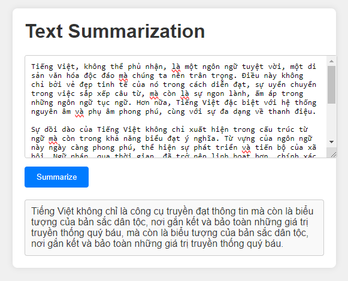
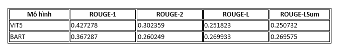

# Text-Summarizer



  
## Workflows

1. Update config.yaml
2. params.yaml
3. Update entity
4. Update the configuration manager in src config
5. Update components
6. Update the pipeline
7. Update the main.py
8. Update the app.py

# How to run?
### STEPS:

Clone the repository

```bash
https://github.com/trunglam2002/text-summarization
```
### STEP 01- Create a virtual environment after opening the repository (vscode)

```bash
python -m venv venv
```

```bash
.\.venv\Scripts\activate
```


### STEP 02- install the requirements
```bash
pip install -r requirements.txt
```


```bash
# Finally run the following command
python app.py
```

Now,
```bash
open up you local host and port
```
